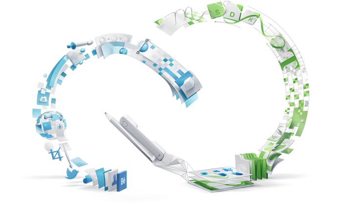

# End of Support for the Creative SDK Content Management, Workflow, and Authentication Components

Adobe is ending support for the Creative SDK Content Management, Workflow, and Authentication components for iOS, Android, and Web.

Existing integrations of the Creative SDK should continue to work, as we’re not shutting down core services behind the Creative SDK at this time. However, the underlying platform and APIs will be evolving over the next 12-24 months, so we are no longer building the Creative SDK. Therefore, in the best interest of our developer community, we’re no longer supporting new integrations of it. Authentication capabilities will continue to be available. Please see the [FAQs](../faq/creative-sdk-components-end-of-life.md) for more information.

Here are more details on the end of support to help you plan:

- Adobe is ending support for the Creative SDK Content Management, Workflow, and Authentication components for iOS, Android and Web. The specific Creative SDK features within these components include the Asset Browser UI, CC Files API, CC Libraries API, Lightroom Photos API, Typekit (Fonts) UI, PSD filetype read/write, AI filetype write, Send to Desktop, and Authentication.

- Existing integrations of the Creative SDK Content Management, Workflow, and Authentication components should continue to work, as we’re not deprecating core services behind the Creative SDK.

- At this point, Adobe is no longer providing developer support for partners working on Creative SDK integrations. Over the next few months, Adobe will remove the Creative SDK Support Center.

- Adobe is no longer reviewing Creative SDK Production Mode ID requests submitted through the Adobe I/O Console.

- For partners using the Typekit UI, we recommend that you migrate to the [Adobe Fonts platform](https://www.adobe.io/apis/creativecloud/adobe-fonts.html) as soon as possible.

- [Authentication workflows](https://www.adobe.io/authentication.html) will continue to be available and Creative SDK scopes will continue to be supported.

The existing services behind the Creative SDK will continue to function, and some alternatives will be available for developers in the future.

Adobe continues to invest in the developer community, and over the past year, we’ve started several initiatives to support developers that want to integrate with Creative Cloud. We introduced the future of Creative Cloud in-app extensibility with the [Unified Extensibility Platform (UXP)](https://medium.com/adobetech/xd-and-creative-cloud-extensibility-faq-e615dd6ecbfe), and launched the first instance of a UXP-powered ecosystem with [XD plugins](https://theblog.adobe.com/adobe-launches-xd-ecosystem-at-max/). Last year, we also launched the [Adobe Fund for Design](https://www.adobe.com/products/xd/adobe-fund.html), a $10M fund for entrepreneurs pushing the boundaries of the creative tool ecosystem, and we recently announced the [Adobe XD Plugin Accelerator](https://theblog.adobe.com/incubating-design-tooling-adobe-fund-for-design-plugin-accelerator).

You can read more about the recent developments of the Creative Cloud developer ecosystem [here](https://medium.com/adobetech/creative-cloud-updates-this-year-d2fc1628b71), see all of our APIs and SDKs on [adobe.io](https://www.adobe.io/apis.html) and learn more about the Creative SDK news on our [FAQs](../faq/creative-sdk-components-end-of-life.md).
